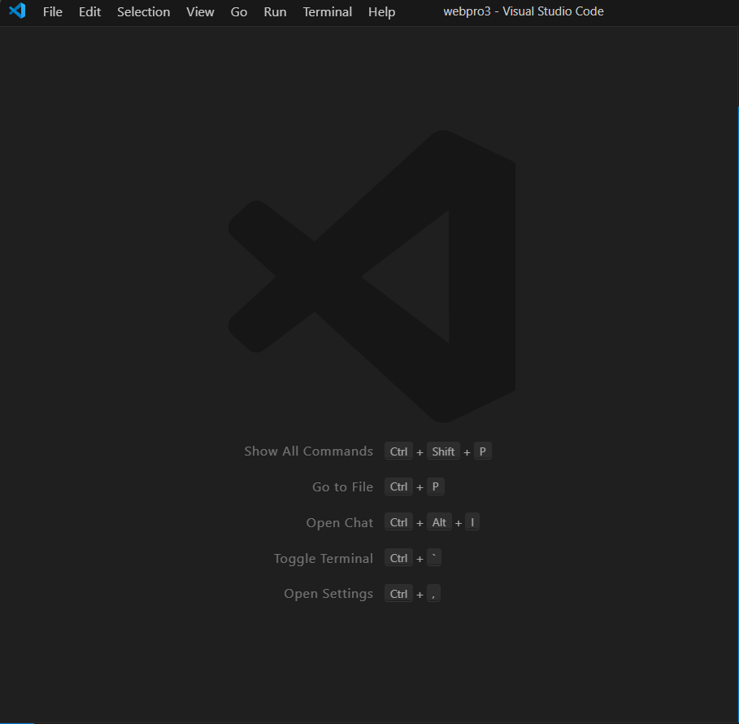
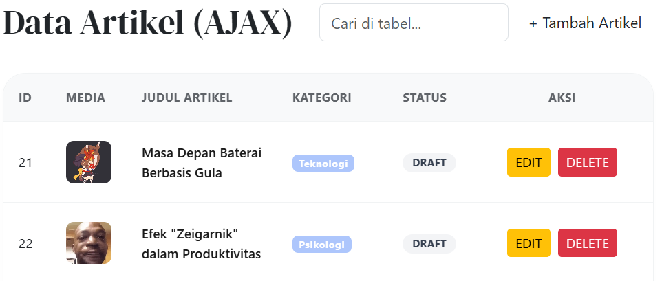
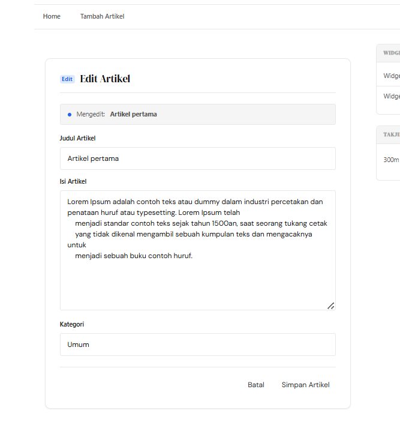
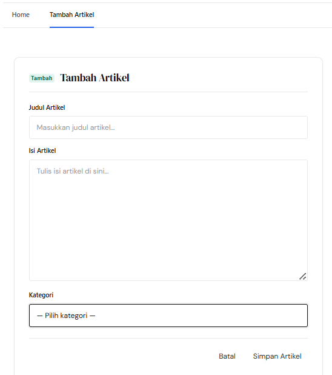
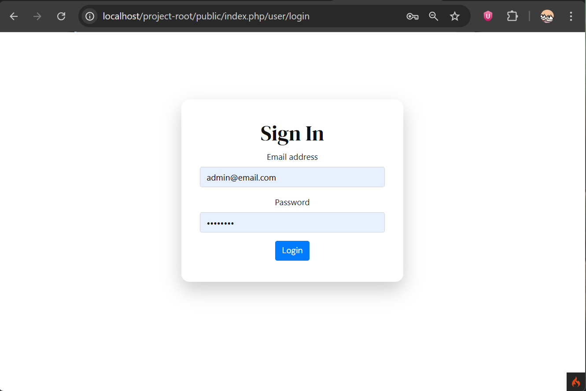
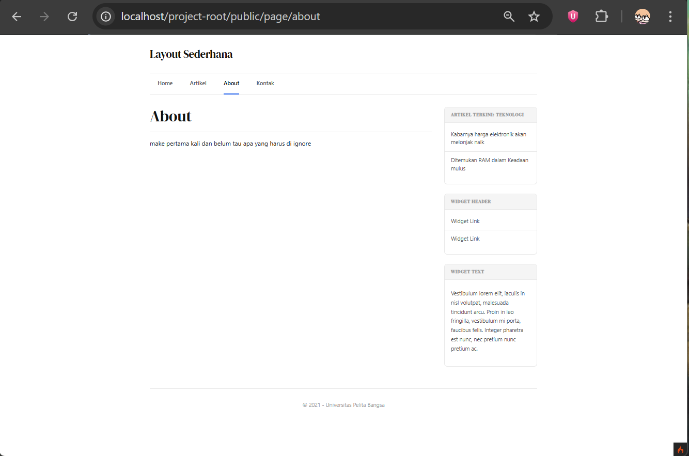

# WebApp simple menggunakan Codeigniter 4

untuk WebApp simple pake framework Codeigniter 4 (4.7.2)

## Langkah-langkah 


1. **Persiapan**
    - Editornya, misal Visual Studio Code.
    
    
    - XAMPP, kalo belum punya unduh dulu di [sini](https://www.apachefriends.org/).

    - Buka XAMPP control panel dulu, aktifin ``apache`` dan ```mysql``` lalu ke ```php.ini```
     
    
    buat aktifin 
    

    - Clone [Lab7Web_CI4](https://github.com/laLafid/Lab7Web_CI4)


2. **Part 8 : AJAX (Asynchronous JavaScript and XML)**
    - AJAX untuk load daftar artikel juga gunakan banyak dom

    - Buat dulu controllernya [Ajax.php](app/Controllers/Ajax.php)

    - Lalu buat view untuk Ajax di [index.php](app/Views/ajax/index.php)

    - tampaknya :
    


## Hasil Akhir

1. **Gambar**

    **Admin**:

    [Admin Dashboard](app/Views/artikel/admin_index.php)
    

    [Edit Artikel](app/Views/artikel/form_edit.php)
    

    [Add Artikel](app/Views/artikel/form_add.php)
    

    **Login Page**:
    [Login](app/Views/user/login.php)
    

    **User**:

    [Home](app/Views/vi/home.php)
    

    [About](app/Views/vi/about.php)
    

    [Artikel](app/Views/artikel/index.php)
    
    

    [Kontak](app/Views/vi/contact.php)
    
    

## Akhir Kata

*Selamat mencoba*
